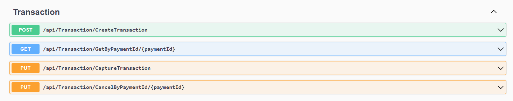
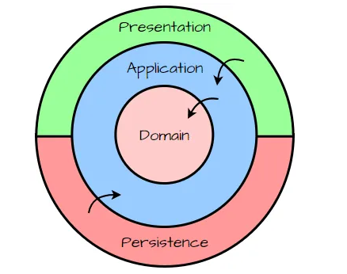
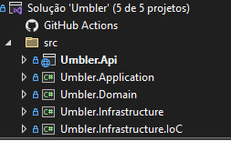

# Desafio Umbler

Projeto tem como objetivo criar, capturar e cancelar transações no ambiente Cielo.

## 🚀 Começando

Essas instruções permitirão que você obtenha uma cópia do projeto em operação na sua máquina local para fins de desenvolvimento e teste.

### 📋 Pré-requisitos

O que vai precisar:

```
sdk .Net Core 8
Visual Studio(Community ou Code)
Cadastro válido no sandbox da Cielo (merchantId e merchantKey)
```

### 🔧 Para executar em ambiente local

Para executar de forma correta o projeto será necessário já possuir as chaves <strong>"merchantId"</strong> <strong>"merchantKey"</strong>.

Abra a classe CieloTransactionRepository que se encontra dentro de Umbler.Infrastructure/Repositories.
Substitua <strong>"merchantId"</strong> <strong>"merchantKey"</strong>.

```
_merchantId = "Insira seu merchantId";
_merchantKey = "Insira seu merchantKey";
```

Após executar o projeto, terá acesso aos endpoints para criar, buscar por paymentId, capturar transação e cancelar transação.



## ⚙️ Criar uma transação

Explicar como executar os testes automatizados para este sistema.
```
{
  "merchantOrderId": "2014111701",
  "customer": {
    "name": "Comprador crédito completo",
    "email": "comprador@teste.com"
  },
  "payment": {
    "type": "CreditCard",
    "amount": 15700,
    "installments": 1,
    "capture": false,
    "softDescriptor": "123456789ABCD",
    "creditCard": {
      "cardNumber": "1234123412341231",
      "holder": "TesteHolder",
      "expirationDate": "12/2030",
      "securityCode": "123",
      "brand": "Visa"
    }
  }
}
```
Lembrando que para capturar a transação o campo <b>capture</b> deve ser <b>false</b>.

Resposta ao criar uma transação status 200
```
{
  "merchantOrderId": "2014111701",
  "name": "Comprador crédito completo",
  "paymentId": "99b42170-603d-4d46-901d-e54855e3b3ca",
  "status": 1,
  "returnCode": "4",
  "returnMessage": "Operation Successful",
  "creditCard": {
    "cardNumber": "123412******1231",
    "holder": "TesteHolder",
    "expirationDate": "12/2030",
    "securityCode": "12/2030",
    "brand": "Visa"
  }
}
```

## 📦 Implantação

Nesse projeto utilizei .net core 8 e os princípios de clean architecture.



Nosso projeto ficou da seguinte forma:



## ✒️ Autor

Vinicius Marques | [github](https://github.com/viniciusmzo) | [linkedin](https://www.linkedin.com/in/vinicius-marques-de-oliveira/) |

## 🎁🎁🎁

Agradeço a equipe Umbler pelo desafio ❤️😊

---